# TicketResolve — Terraform Workspace (`infra/`)

Workspace de Terraform que aprovisiona la infraestructura de TicketResolve en AWS.

- **Cloud provider:** AWS
- **Región por defecto:** `us-east-1`
- **Versión de Terraform:** `~> 1.8`
- **Versión del proveedor AWS:** `~> 5.0`
- **Estado:** **Remoto** (S3 + DynamoDB lock) desde Delivery 2 — ver [`bootstrap/`](bootstrap/) y [`backend.tf`](backend.tf).
- **Track:** Standard (no EKS) — CI sobre GitHub Actions

## Estructura del directorio

```
infra/
  versions.tf              # required_version + required_providers
  provider.tf              # provider "aws" + default_tags
  backend.tf               # S3 + DynamoDB remote state backend (D2)
  variables.tf             # input variables del root
  locals.tf                # naming derivado (no hardcoded en module calls)
  main.tf                  # llama a los módulos (storage/database/compute/network/security/ingress) + seed
  moved.tf                 # state migration del API Gateway a modules/ingress (D3)
  outputs.tf               # outputs consumibles por evidence scripts y D3+
  bootstrap/               # workspace separado para crear el state backend
    main.tf, variables.tf, outputs.tf, terraform.tfstate (committeado)
  modules/
    storage/               # bucket S3 reusable (versioning + lifecycle + SSE + SSL-only)
    database/              # tabla DynamoDB single-table con GSI1 y GSI2
    compute/               # Lambda + IAM execution role + log group (source_dir opcional)
    network/               # VPC + subnets (pública/privada-app/privada-data ×2 AZ) + IGW + NAT + route tables + Gateway Endpoints (D3)
    security/              # SGs web/app/db (SG-to-SG) + NACLs pública/privada (D3)
    ingress/               # API Gateway HTTP API + Lambda proxy + health check (D3)
  lambda_src/
    api_tickets/           # handler Python real para el E2E proof (GET DynamoDB / POST S3) (D3)
  envs/
    dev/dev.tfvars         # overrides para dev (lo usa el CI)
    prod/                  # vacío hasta Delivery 3+
  evidence/                # outputs CLI y screenshots requeridos por el rubric
  docs/                    # resúmenes por entrega (.md)
```

## Bootstrap workspace

Antes de poder usar este workspace con el backend remoto, el bucket de state y la tabla de lock tienen que existir. Eso se hace **una sola vez** en [`infra/bootstrap/`](bootstrap/README.md). Ver el README de ese subdirectorio para los detalles.

## Credenciales requeridas

El provider AWS se autentica usando las variables de entorno estándar de la CLI de AWS. **No** se hardcodean credenciales en ningún `.tf`.

| Variable                | Propósito                                        |
| ----------------------- | ------------------------------------------------ |
| `AWS_ACCESS_KEY_ID`     | Access Key del usuario IAM del equipo            |
| `AWS_SECRET_ACCESS_KEY` | Secret Key correspondiente                       |
| `AWS_REGION`            | Región (debe coincidir con `var.region`)         |

En CI se inyectan como GitHub Actions secrets con el mismo nombre. Las credenciales largas (long-lived) se reemplazarán por OIDC federation en Delivery 5.

## Inicialización y comandos

```bash
cd infra
terraform fmt -recursive
terraform init                                # usa el backend remoto definido en backend.tf
terraform validate
terraform plan -var-file=envs/dev/dev.tfvars
terraform apply -var-file=envs/dev/dev.tfvars
```

## Variables de entrada (root)

| Variable                  | Tipo   | Default     | Descripción                                                                 |
| ------------------------- | ------ | ----------- | --------------------------------------------------------------------------- |
| `environment`             | string | _(none)_    | `dev` o `prod`. Drives naming/tagging.                                      |
| `app_name`                | string | _(none)_    | Prefijo de nombres y tag `Project`.                                         |
| `region`                  | string | `us-east-1` | Región de AWS donde se crean los recursos.                                  |
| `architecture`            | string | `x86_64`    | CPU arch por defecto para futuros workloads (tag/env propagado).            |
| `lambda_memory_default`   | number | `256`       | MB de memoria por defecto para Lambdas livianas.                            |
| `lambda_timeout_default`  | number | `10`        | Timeout por defecto (s) para Lambdas livianas.                              |

Cada módulo define además sus propios inputs específicos — ver el README de cada módulo en `modules/<nombre>/`.

## Outputs (root)

| Output                    | Descripción                                                              |
| ------------------------- | ------------------------------------------------------------------------ |
| `workspace_region`        | Región AWS efectiva.                                                     |
| `attachments_bucket_name` | Bucket S3 para adjuntos de tickets.                                      |
| `attachments_bucket_arn`  | ARN del bucket de attachments (para IAM policies aguas abajo).           |
| `reports_bucket_name`     | Bucket S3 para reportes PDF mensuales.                                   |
| `reports_bucket_arn`      | ARN del bucket de reportes.                                              |
| `database_table_name`     | Nombre de la tabla DynamoDB single-table.                                |
| `database_table_arn`      | ARN de la tabla.                                                         |
| `database_stream_arn`     | ARN del DynamoDB Stream (lo consumirá un Lambda de auditoría en D4).     |
| `lambda_function_names`   | Map `logical_key -> function_name` para los 5 Lambdas.                   |
| `lambda_function_arns`    | Map `logical_key -> arn` para los 5 Lambdas.                             |
| `api_gateway_endpoint`    | Endpoint público HTTPS del API Gateway HTTP API.                         |
| `api_gateway_id`          | ID del HTTP API.                                                         |
| `ingress_url`             | URL del recurso `/api/v1/incidents` (endpoint E2E GET/POST).            |
| `health_check_url`        | URL del health/readiness check del ingress.                             |
| `vpc_id`                  | ID de la VPC (módulo network).                                          |
| `public_subnet_ids`       | IDs de subnets públicas (una por AZ).                                   |
| `private_subnet_ids`      | IDs de todas las subnets privadas (app + data).                         |
| `private_app_subnet_ids`  | IDs de subnets privadas-app (ENIs de Lambda).                          |
| `private_data_subnet_ids` | IDs de subnets privadas-data (reservadas).                             |
| `nat_gateway_ids`         | IDs de NAT Gateway(s).                                                  |
| `security_group_ids`      | Map `tier -> sg id` (web/app/db).                                       |

## Módulos

### `modules/storage`

Provisiona **un** bucket S3 con: versioning enabled, lifecycle rules con prefijo obligatorio, SSE-S3 (AES256), bucket policy que niega `s3:*` cuando `aws:SecureTransport=false`, y bloqueo total de acceso público. Inputs: `bucket_name`, `environment`, `lifecycle_rules` (lista de objetos con `id`, `prefix`, opcional `transition_days/transition_storage_class`, opcional `expiration_days`). Outputs: `bucket_arn`, `bucket_name`, `bucket_regional_domain_name`.

Llamado dos veces desde el root: una para `attachments` (transición a IA a 30 días, expiración 1 año) y otra para `reports` (expiración a 90 días).

### `modules/database`

Provisiona **una** tabla DynamoDB single-table: `PK` (string) como hash key, `SK` (string) como sort key, **GSI1** (`GSI1PK`/`GSI1SK`, projection ALL) para el dashboard del ingeniero ordenado por SLA, **GSI2** (`GSI2PK`/`GSI2SK`, projection ALL) para detección de duplicados por hash de evento. TTL habilitado sobre el atributo `ttl`. SSE habilitado con default AWS-managed keys. Stream `NEW_AND_OLD_IMAGES` habilitado para el auditor de D4. Outputs: `table_arn`, `table_name`, `gsi1_arn`, `gsi2_arn`, `stream_arn`.

### `modules/compute`

Provisiona **un** Lambda + IAM execution role + CloudWatch log group + código Python placeholder via `data "archive_file"`. La execution role incluye solo permisos mínimos sobre el propio log group (sin wildcards) más los `additional_iam_statements` que el caller pase (cada uno con `sid`, `actions` y `resources` explícitos — wildcards rechazadas por `validation`). Outputs: `function_arn`, `function_name`, `invoke_arn`, `role_arn`, `role_name`, `log_group_name`.

Llamado cinco veces desde el root: `api-tickets`, `webhook-ingesta`, `escalamiento`, `notificacion`, `reporte-pdf`. Cada uno con su memoria/timeout y sus permisos scoped (acceso a la tabla DynamoDB y/o a los buckets que realmente usa).

### `modules/network` (Delivery 3)

Provisiona la VPC completa: `aws_vpc` `10.20.0.0/16` (DNS support + hostnames), **6 subnets** en 2 AZs (2 públicas, 2 privadas-app, 2 privadas-data, cada una `/24`), un Internet Gateway, **1 NAT Gateway** (topología configurable con `single_nat_gateway`) con su Elastic IP en una subnet pública, route tables explícitas (1 pública → IGW, 1 privada-app por AZ → NAT, 1 privada-data solo-local) con sus asociaciones, y **2 Gateway VPC Endpoints** gratuitos (S3 y DynamoDB) asociados a las route tables privada-app. Inputs: `name_prefix`, `environment`, `vpc_cidr`, `availability_zones`, `public_subnet_cidrs`, `private_app_subnet_cidrs`, `private_data_subnet_cidrs`, `enable_nat_gateway`, `single_nat_gateway`, `tags`. Outputs: `vpc_id`, `vpc_cidr`, `public_subnet_ids`, `private_app_subnet_ids`, `private_data_subnet_ids`, `private_subnet_ids`, `nat_gateway_ids`, `internet_gateway_id`, route table ids y los ids de los Gateway Endpoints.

### `modules/security` (Delivery 3)

Define el control de acceso por capas. **SGs tier web→app→db** con reglas SG-to-SG (referencias de security group, no CIDRs) declaradas como recursos `aws_vpc_security_group_ingress_rule`/`egress_rule` **separados** para evitar el ciclo de dependencia. `web-sg`: ingress 80/443 desde `web_ingress_cidrs`, egress al app-sg. `app-sg`: ingress solo desde web-sg, egress al db-sg. `db-sg`: ingress solo desde app-sg en el puerto de BD, **sin ingress 0.0.0.0/0 y sin egress** (sin salida directa a Internet). **NACLs stateless**: una para subnets públicas y una para privadas, con reglas inbound/outbound explícitas (`aws_network_acl_rule`). Todos los puertos y CIDRs son variables. Consume `vpc_id`, `vpc_cidr` y subnet ids del módulo network. Outputs: `web_sg_id`, `app_sg_id`, `db_sg_id`, `public_nacl_id`, `private_nacl_id`.

### `modules/ingress` (Delivery 3)

Encapsula el **API Gateway HTTP API** (Lambda proxy) — el único punto de entrada público del compute. Rutas: `GET <health_check_path>` (health), `GET /api/v1/incidents` (E2E read), `POST /api/v1/incidents` (E2E write) → `api-tickets`; `POST /api/v1/webhooks` → `webhook-ingesta`. Incluye el stage `$default` con `auto_deploy` y los `aws_lambda_permission` que autorizan la invocación. Inputs: `api_name`, `environment`, `health_check_path`, config CORS, e invoke_arn/function_name de los dos Lambdas. Outputs: `api_id`, `api_endpoint`, `execution_arn`, `health_check_url`, `incidents_url`. En D2 estos recursos vivían inline en `main.tf`; D3 los migró aquí con bloques `moved{}` (ver [`moved.tf`](moved.tf)) — el `plan` mostró **0 destroy**.

## Pipeline de CI

El workflow [`.github/workflows/terraform-ci.yml`](../.github/workflows/terraform-ci.yml) se dispara en cada Pull Request hacia `main` y ejecuta:

1. `terraform fmt --check -recursive`
2. `terraform init -input=false -lock-timeout=60s` _(D2: init completo con backend remoto, ya no `-backend=false` porque el plan necesita leer el state)_
3. `terraform validate`
4. `terraform plan -var-file=envs/dev/dev.tfvars -lock-timeout=60s`
5. Publica el output del plan como comentario colapsable en el PR (non-blocking desde el fix post-D1).

Los pasos 1–4 bloquean el merge si fallan. El plan adquiere el lock de DynamoDB durante su corrida; corre rápido y lo libera al terminar.

**Apply on merge (Delivery 3).** El workflow [`.github/workflows/terraform-apply.yml`](../.github/workflows/terraform-apply.yml) se dispara en `push` a `main` (cambios bajo `infra/**`) y ejecuta `terraform init` + `terraform apply -auto-approve -var-file=envs/dev/dev.tfvars`, aprovisionando los recursos de red/seguridad/ingress además de compute/storage/database. Usa un `concurrency group` para que dos applies no compitan por el lock de state. Las credenciales se inyectan vía GitHub Actions secrets como `TF_VAR_*`/`AWS_*` — sin valores hardcodeados en el YAML; todo lo específico de ambiente vive en `envs/dev/dev.tfvars`.

## Evidence

Artefactos requeridos por el rubric, capturados durante la corrida real de aprovisionamiento de Delivery 2.

### Compute deployed — `aws lambda get-function` + `list-functions`

Archivo: [`evidence/compute-deployed.txt`](evidence/compute-deployed.txt)

```text
--------------------------------------------------------------------------------------------------
|                                           GetFunction                                          |
+--------------+---------------------------------------------------------------------------------+
|  FunctionArn |  arn:aws:lambda:us-east-1:010526283195:function:ticketresolve-api-tickets-dev   |
|  LastModified|  2026-05-21T05:23:35.220+0000                                                   |
|  MemorySize  |  512                                                                            |
|  Runtime     |  python3.12                                                                     |
|  State       |  Active                                                                         |
|  Timeout     |  10                                                                             |
+--------------+---------------------------------------------------------------------------------+

--- All 5 TicketResolve Lambdas (aws lambda list-functions filtered) ---

-----------------------------------------------------------------------------------
|                                  ListFunctions                                  |
+--------+-------------------------------------+-------------+--------+-----------+
| Memory |                Name                 |   Runtime   | State  |  Timeout  |
+--------+-------------------------------------+-------------+--------+-----------+
|  512   |  ticketresolve-api-tickets-dev      |  python3.12 |  None  |  10       |
|  1024  |  ticketresolve-reporte-pdf-dev      |  python3.12 |  None  |  60       |
|  256   |  ticketresolve-escalamiento-dev     |  python3.12 |  None  |  60       |
|  256   |  ticketresolve-notificacion-dev     |  python3.12 |  None  |  30       |
|  512   |  ticketresolve-webhook-ingesta-dev  |  python3.12 |  None  |  10       |
+--------+-------------------------------------+-------------+--------+-----------+
```

> El campo `State` aparece como `None` en `list-functions` porque ese subcommand devuelve solo `FunctionConfiguration` summary; el `State: Active` real de cada Lambda se confirma con `get-function` (primer cuadro). Los 5 Lambdas están `Active` en `us-east-1`.

### Remote state migration — `terraform init` output

Archivo: [`evidence/state-migration.txt`](evidence/state-migration.txt)

Confirmación clave: `Successfully configured the backend "s3"!` + `terraform state list` lee 69 entries desde S3 + `aws s3 ls s3://ticketresolve-tfstate-010526283195/infra/` muestra `terraform.tfstate` (150KB).

### Lock contention — DynamoDB rechaza un segundo plan concurrente

Archivo: [`evidence/state-lock-contention.png`](evidence/state-lock-contention.png)

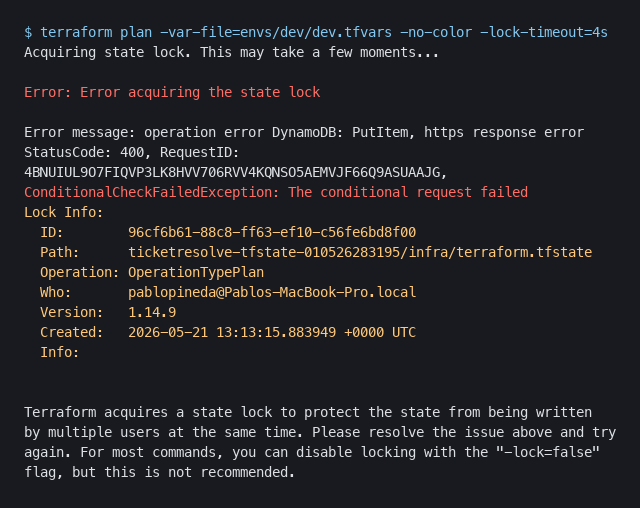

Reproducción: con un `terraform plan` corriendo en background sosteniendo el lock, un segundo `terraform plan -lock-timeout=4s` falla con `Error: Error acquiring the state lock` (`ConditionalCheckFailedException` desde la tabla `ticketresolve-tflock` en DynamoDB). El segundo proceso muestra el lock owner (host, PID, operación y timestamp) — exactamente el comportamiento que la tabla de lock está pensada para prevenir.

---

## Evidence — Delivery 3 (Networking)

Track: **VPC-required**. Aprovisionado en la cuenta `010526283195` / `us-east-1`. VPC `vpc-0489f18f6463adda0`, NAT `nat-01602aa6280cc0a72`, API endpoint `https://o2mbl3sx1i.execute-api.us-east-1.amazonaws.com`.

### Deliverable A — Network Foundation (`terraform output`)

Archivo: [`evidence/network-foundation.txt`](evidence/network-foundation.txt)

```text
vpc_id                  = "vpc-0489f18f6463adda0"
public_subnet_ids       = ["subnet-0a7061f18be644d85", "subnet-07663e3e31b7f98b7"]
private_app_subnet_ids  = ["subnet-07f9c50261f15276b", "subnet-072c27b8cf25d1563"]
private_data_subnet_ids = ["subnet-0a63ade8e383b06b9", "subnet-01641b3ea39db5242"]
private_subnet_ids      = ["subnet-07f9c50261f15276b", "subnet-072c27b8cf25d1563",
                           "subnet-0a63ade8e383b06b9", "subnet-01641b3ea39db5242"]
nat_gateway_ids         = ["nat-01602aa6280cc0a72"]
security_group_ids      = { app = "sg-044a3e38e9e769099", db = "sg-01c1e5856bd509daf", web = "sg-0d5a8a6c43ce13a1a" }
```

### Deliverable B — Network Security

Plan excerpt de las reglas de SG/NACL: [`evidence/security-groups-plan.txt`](evidence/security-groups-plan.txt) — muestra `web-sg`/`app-sg`/`db-sg` con reglas SG-to-SG (`referenced_security_group_id`) y las NACLs pública/privada con sus reglas stateless explícitas.

Política IAM least-privilege del Lambda api-tickets (sin wildcards, scoped a la tabla + GSIs + bucket): [`evidence/api-tickets-iam-policy.txt`](evidence/api-tickets-iam-policy.txt).

Screenshot de consola (inbound/outbound rules): `evidence/security-groups.png` _(pendiente de captura en consola)_.

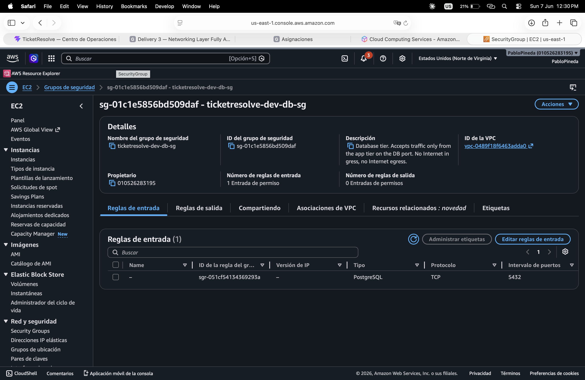

### Deliverable C — Public Ingress (`curl -v`)

Archivo: [`evidence/ingress-curl.txt`](evidence/ingress-curl.txt)

```text
> GET / HTTP/2
< HTTP/2 200
< content-type: application/json
{"status": "ok", "service": "api-tickets"}
```

Screenshot de la consola del API Gateway mostrando las integraciones/rutas: `evidence/ingress-healthy.png` _(pendiente de captura)_.

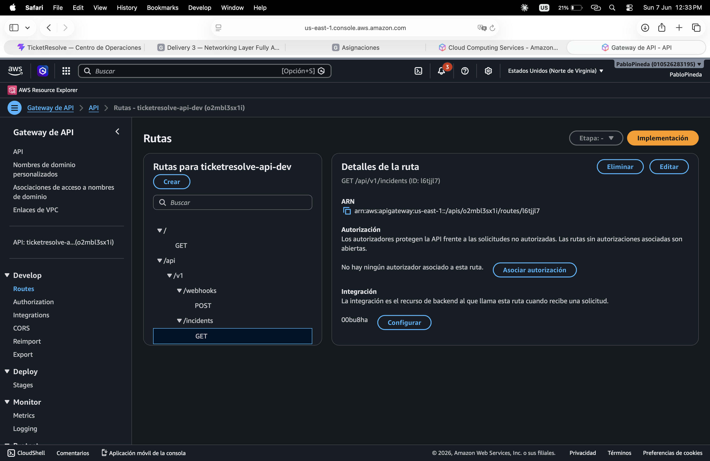

### Deliverable D — End-to-End Connectivity Proof

**GET** — lee de DynamoDB ([`evidence/e2e-get.txt`](evidence/e2e-get.txt)):

```text
> GET /api/v1/incidents HTTP/2
< HTTP/2 200
{"source": "dynamodb", "table": "ticketresolve-dev", "item": {"PK": "TICKET#seed", "SK": "META",
 "title": "Seed incident for the Delivery 3 end-to-end proof", "severity": "P2", "status": "OPEN",
 "source": "terraform-seed", "GSI1PK": "ASSIGN#unassigned", "GSI1SK": "STATUS#OPEN#SLA#2026-06-07T23:55:00Z"}}
```

**POST** — escribe a S3 ([`evidence/e2e-post.txt`](evidence/e2e-post.txt)):

```text
> POST /api/v1/incidents HTTP/2
< HTTP/2 201
{"source": "s3", "bucket": "ticketresolve-attachments-dev-010526283195",
 "key": "attachments/2026-06-07T18-12-07Z-e31dea2be3074b869f021d1e9363bfcb.json"}
```

El seed lo provisiona el recurso `aws_dynamodb_table_item.seed_ticket` (committeado, no insertado por consola). Screenshot del objeto en S3: `evidence/e2e-storage.png` _(pendiente de captura)_.

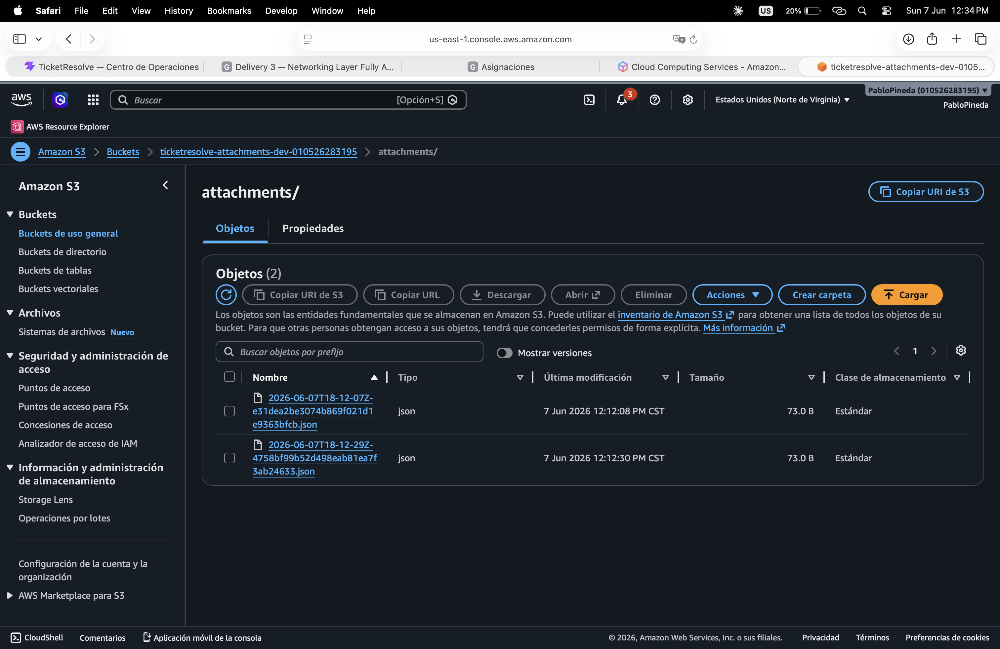

### Deliverable E — CI Pipeline

`plan-on-PR` ([`terraform-ci.yml`](../.github/workflows/terraform-ci.yml)) publica el plan como comentario del PR; `apply-on-merge` ([`terraform-apply.yml`](../.github/workflows/terraform-apply.yml)) aplica al hacer merge a `main`. Link del PR y screenshot del run exitoso: `evidence/ci-plan.png` _(pendiente de captura del run real del PR)_.

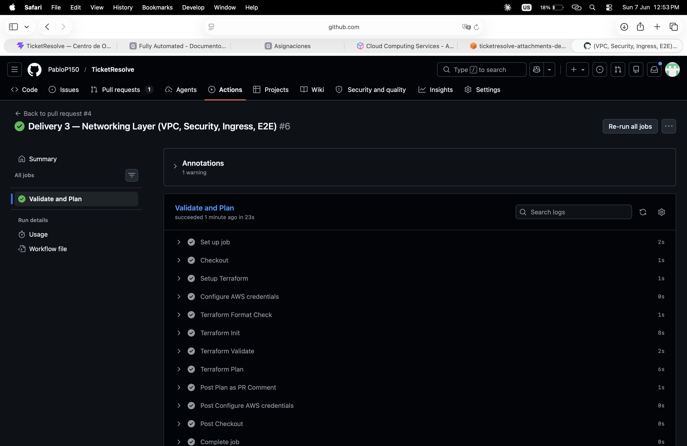

---

## Evidence — Delivery 4 (Async Infrastructure & Full CD Pipeline)

Aprovisionado en vivo en la cuenta `010526283195` / `us-east-1`. Resumen completo en [`docs/delivery-4-summary.md`](docs/delivery-4-summary.md).
Cola SQS `ticketresolve-dev-events`, DLQ `ticketresolve-dev-events-dlq`, schedule `ticketresolve-dev-sla-sweep`.

### Deliverable A — Async Messaging Module (`terraform output`)

Archivo: [`evidence/async-foundation.txt`](evidence/async-foundation.txt)

```text
events_queue_url          = "https://sqs.us-east-1.amazonaws.com/010526283195/ticketresolve-dev-events"
events_queue_arn          = "arn:aws:sqs:us-east-1:010526283195:ticketresolve-dev-events"
events_dlq_url            = "https://sqs.us-east-1.amazonaws.com/010526283195/ticketresolve-dev-events-dlq"
events_dlq_arn            = "arn:aws:sqs:us-east-1:010526283195:ticketresolve-dev-events-dlq"
event_source_mapping_uuid = "3a950a06-7293-4869-bf8f-1a6b5492b992"
enqueue_url               = "https://o2mbl3sx1i.execute-api.us-east-1.amazonaws.com/api/v1/incidents/enqueue"
sla_sweep_schedule_name   = "ticketresolve-dev-sla-sweep"
sla_sweep_schedule_arn    = "arn:aws:scheduler:us-east-1:010526283195:schedule/default/ticketresolve-dev-sla-sweep"
```

Módulo reusable: [`modules/async/`](modules/async/) (SQS main + DLQ con `redrive_policy`, `max_receive_count = 5`), llamado desde el root como `module "events_queue"` sin valores hardcodeados.

### Deliverable B — Event-Driven Compute

Plan/estado del event source mapping (SQS → consumer `notificacion`): [`evidence/event-source-plan.txt`](evidence/event-source-plan.txt) — `batch_size = 10`, `maximum_batching_window_in_seconds = 5`, `function_response_types = ["ReportBatchItemFailures"]`, `event_source_arn` y `function_arn` desde outputs de módulo. IAM del consumer scoped a `sqs:ReceiveMessage/DeleteMessage/GetQueueAttributes` sobre el ARN de la cola (sin wildcards).

Screenshot de la consola (Lambda → Triggers, o SQS → Lambda triggers): `evidence/event-source.png` _(pendiente de captura en consola)_.

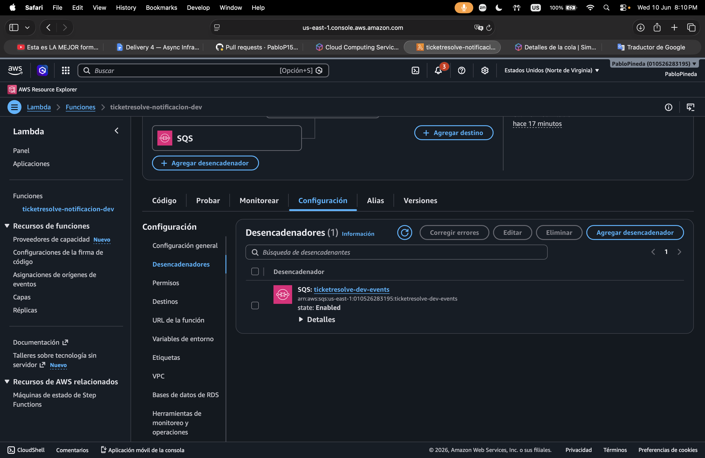

### Deliverable C — Scheduled Job

Plan/estado del `aws_scheduler_schedule`: [`evidence/scheduler-plan.txt`](evidence/scheduler-plan.txt) — `schedule_expression = "rate(1 day)"`, `schedule_expression_timezone = "America/Guatemala"`, target = `ticketresolve-escalamiento-dev`, rol dedicado `ticketresolve-dev-sla-sweep-invoke` con `lambda:InvokeFunction` scoped al ARN de esa función (sin wildcard).

Screenshot de EventBridge Scheduler: `evidence/scheduler.png` _(pendiente de captura en consola)_.

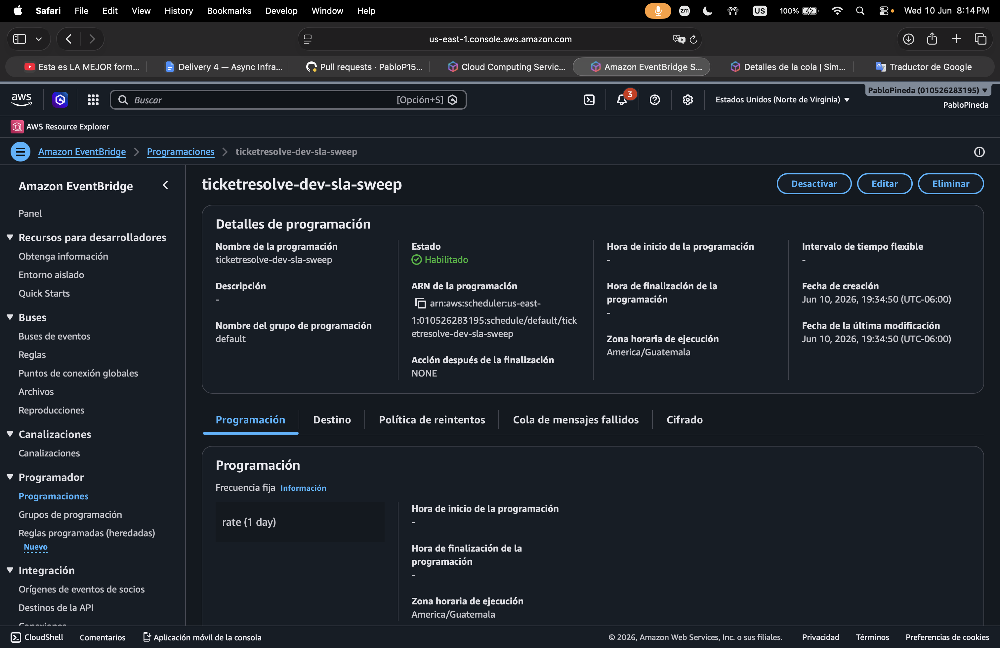

### Deliverable D — Full CD Pipeline

Layout multi-entorno [`envs/dev/`](envs/dev/) y [`envs/staging/`](envs/staging/), Pattern A (backends separados: `backend-dev.hcl` → `env/dev/terraform.tfstate`, `backend-staging.hcl` → `env/staging/terraform.tfstate`). `dev.tfvars` vs `staging.tfvars` difieren en ≥5 valores (vpc_cidr, lambda_memory_default, queue_message_retention_seconds, queue_max_receive_count, sla_sweep_schedule_expression).

**Pull request con el plan-on-PR (recursos async comentados):** el workflow corrió y publicó el `terraform plan` (incluyendo las colas SQS, el event source mapping y el scheduler) como comentario en **[PR #5](https://github.com/PabloP150/TicketResolve/pull/5)** — los tres checks `terraform fmt`/`validate`/`plan` en verde antes del merge.

- **plan-on-PR** ([`terraform-ci.yml`](../.github/workflows/terraform-ci.yml)): tres checks nombrados `terraform fmt` / `terraform validate` / `terraform plan`, sube `tfplan` como artifact y comenta el plan en el PR.
- **CD on merge** ([`terraform-apply.yml`](../.github/workflows/terraform-apply.yml)): `plan-dev` sube el artifact → `apply-dev` lo **descarga** y hace `terraform apply tfplan` (sin re-plan, sin `-auto-approve`) → `apply-staging` (`environment: staging`) pausa para el reviewer **PabloP150**.
- **destroy gated** ([`terraform-destroy.yml`](../.github/workflows/terraform-destroy.yml)): solo `workflow_dispatch`, input `environment` (dev/staging), step de confirmación.
- **drift detection** ([`terraform-drift.yml`](../.github/workflows/terraform-drift.yml)): `schedule` semanal, `plan -detailed-exitcode`, output a `$GITHUB_STEP_SUMMARY`, target dev.
- **Ruleset** en `main` (Active): PR requerido, status checks fmt/validate/plan, branches up-to-date, bloqueo de force-push y deletion.

Screenshots _(pendientes de captura)_:

| Evidencia | Archivo |
| --- | --- |
| Settings → Environments (dev + staging con reviewer) | `evidence/github-environments.png` |
| Apply a dev automático tras merge | `evidence/ci-apply-dev.png` |
| Apply a staging con gate + reviewer que aprobó | `evidence/ci-apply-staging.png` |
| Destroy gated (`workflow_dispatch` visible) | `evidence/ci-destroy.png` |
| Drift detection (plan en el summary) | `evidence/ci-drift.png` |
| Settings → Rules → Rulesets (Active, checks fmt/validate/plan) | `evidence/ruleset-config.png` |
| PR con merge bloqueado por check requerido | `evidence/ruleset-blocked-merge.png` |

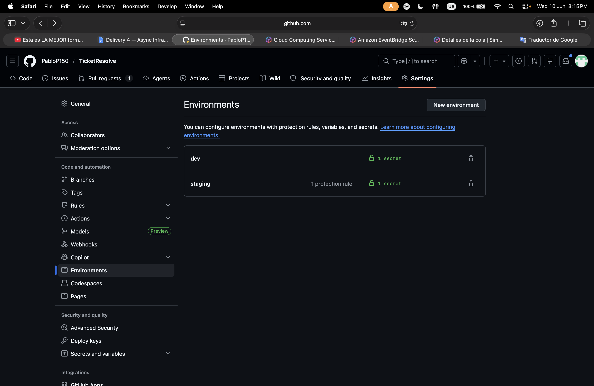
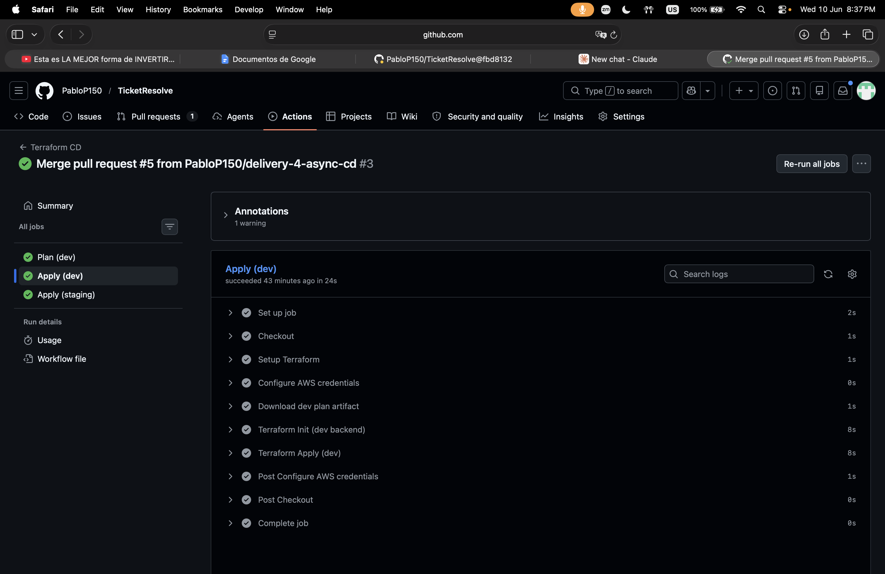
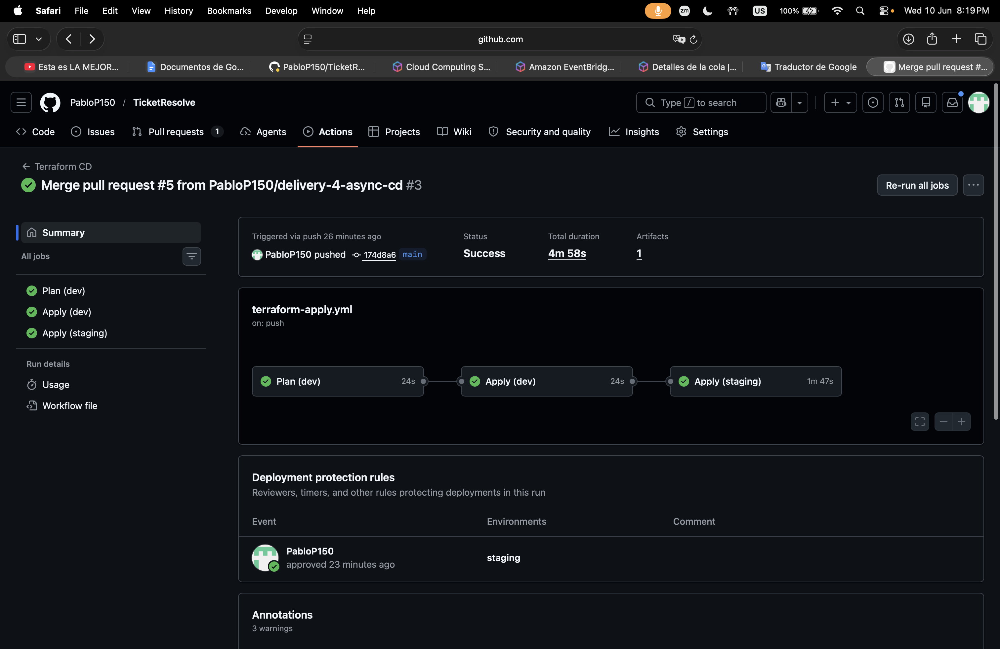
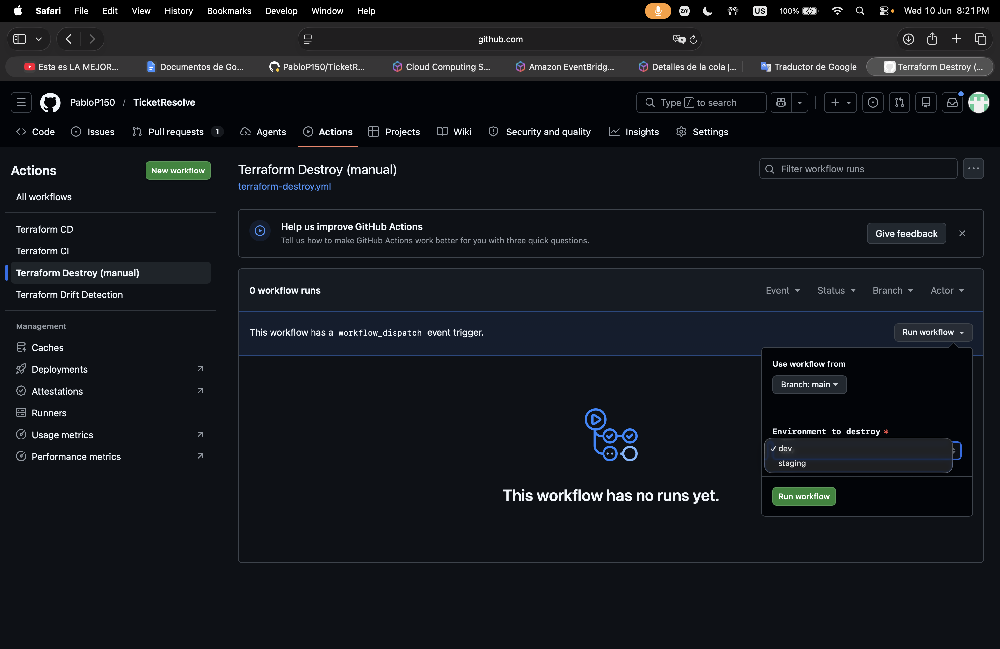
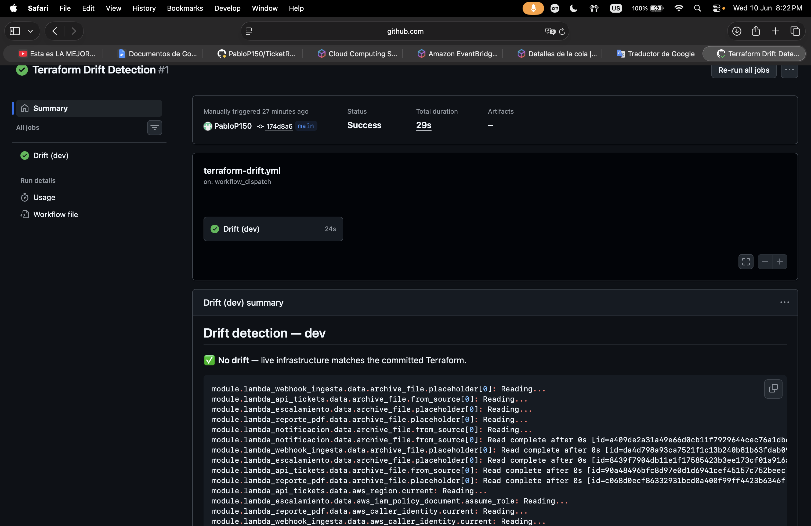
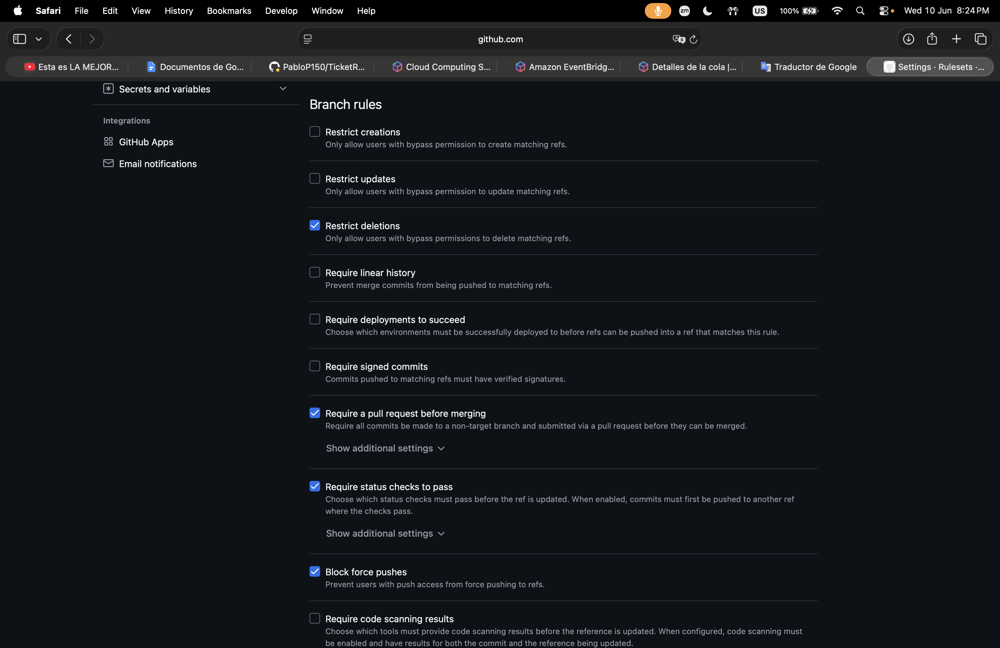
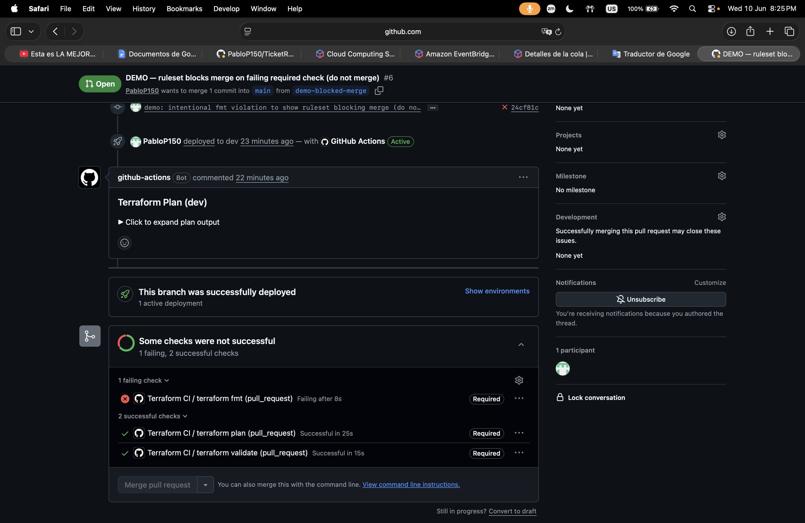

### Deliverable E — End-to-End Async Proof

Archivo: [`evidence/async-enqueue.txt`](evidence/async-enqueue.txt) — `curl POST` real al producer (seed por curl, no por consola):

```text
> POST /api/v1/incidents/enqueue HTTP/2
< HTTP/2 202
{"source": "sqs", "queue_url": ".../ticketresolve-dev-events",
 "message_id": "7e11f39f-7b54-4790-9f43-f2f19b31ec04"}

# Consumer (CloudWatch) — /aws/lambda/ticketresolve-notificacion-dev
[INFO] processed message_id=7e11f39f-… -> s3://ticketresolve-attachments-dev-010526283195/events/7e11f39f-….json
```

El consumer (`notificacion`) se dispara **solo** por el event source mapping (no HTTP), lee el mensaje y escribe `events/<messageId>.json` en el bucket de adjuntos. IAM scoped a la cola y al bucket (sin wildcards).

Screenshots _(pendientes de captura)_:

| Evidencia | Archivo |
| --- | --- |
| Log del consumer en CloudWatch (message_id procesado) | `evidence/async-consumer.png` |
| Objeto nuevo en el bucket S3 | `evidence/async-object.png` |

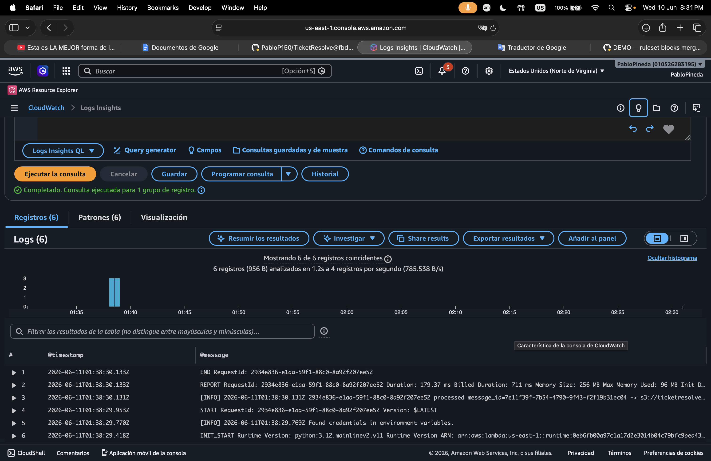
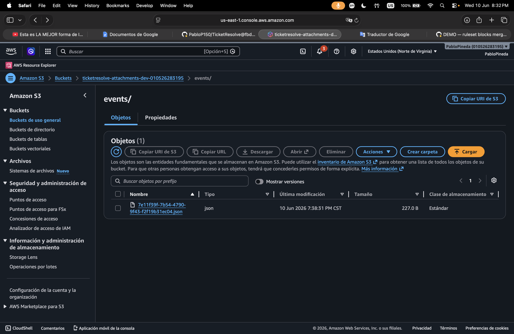

---

## Evidence — Delivery 5 (Security, Observability & One-Click Deployment)

Written summary: [`docs/delivery-5-summary.md`](docs/delivery-5-summary.md) ·
IaC coverage: [`docs/iac-coverage.md`](docs/iac-coverage.md)

### Deliverable A — IAM Security Module

`infra/modules/iam/` defines one explicitly scoped role per service (compute-api,
compute-webhook, compute-escalamiento, async-consumer, compute-reporte,
scheduler) plus the OIDC-assumable CI runner role. **No service role uses a
wildcard Action or Resource.** Every role/policy ARN is a module output and is
consumed by the module calls in `main.tf` (none hardcoded).

Evidence: [`evidence/iam-plan.txt`](evidence/iam-plan.txt) — `terraform plan`
excerpt showing the IAM roles, policies and attachments to be created.

```text
(see evidence/iam-plan.txt — populated by the apply run)
```

### Deliverable B — Secrets Manager & KMS

One customer-managed CMK (`alias/ticketresolve-dev`) encrypts both S3 buckets
(`aws:kms`), the DynamoDB table and the Secrets Manager secret. The key policy is
least-privilege (admin scoped by `aws:PrincipalArn`; usage scoped by
`kms:ViaService` + `kms:CallerAccount`). The notificacion handler reads the
password at runtime via `GetSecretValue` using the injected `DB_SECRET_ARN`;
`TF_VAR_db_password` was retired.

Evidence: [`evidence/secrets-kms.txt`](evidence/secrets-kms.txt) (`terraform
output`) · `evidence/secrets-console.png` (Secrets Manager console).

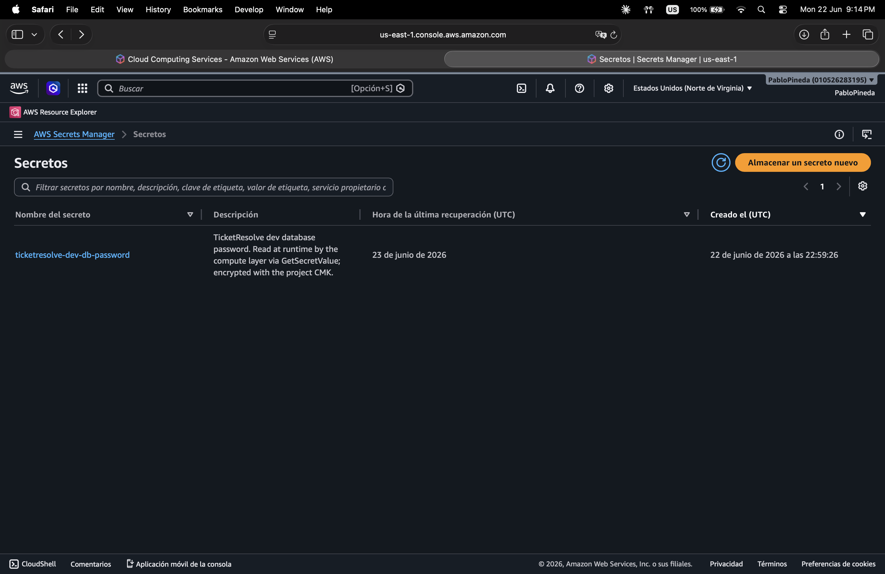

### Deliverable C — OIDC CI Authentication

GitHub Actions OIDC provider provisioned in Terraform; the CI runner trust policy
is scoped to `repo:PabloP150/TicketResolve` subjects (`ref:refs/heads/main` +
`environment:dev`/`staging`, no wildcard). All workflows use
`role-to-assume: ${{ vars.AWS_CI_ROLE_ARN }}` with `id-token: write`; no
long-lived AWS keys remain.

Evidence: `evidence/oidc-secrets-removed.png` (repo secrets after removal) ·
`evidence/oidc-auth-log.png` (workflow run showing the OIDC token exchange).

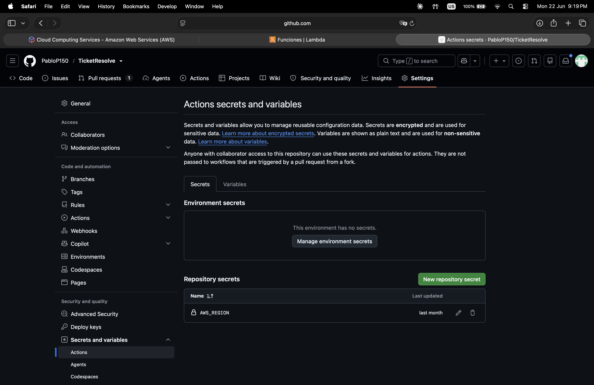
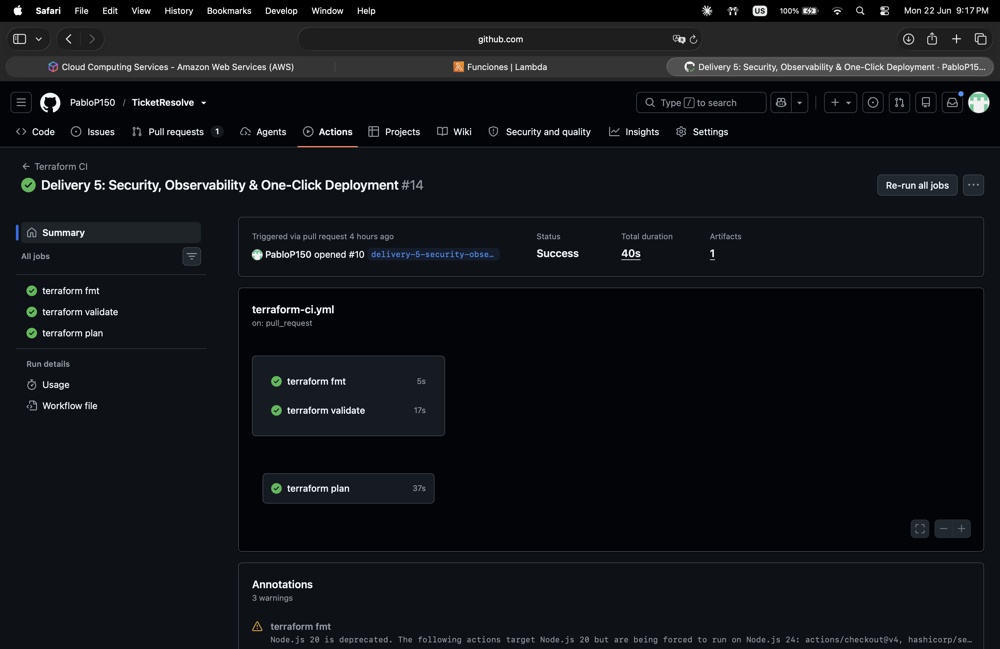

### Deliverable D — TLS Termination (all endpoints)

Regional ACM certificate bound to the API Gateway custom domain
(`api.grupo7.oyd.solid.com.gt`, HTTPS-only) plus a CloudFront distribution
(`app.grupo7.oyd.solid.com.gt`) providing the explicit HTTP→HTTPS 301. Both
endpoints are covered by the same wildcard certificate. Certificate, custom
domain, CloudFront and DNS records are all Terraform; the delegated zone lives in
the bootstrap workspace.

Evidence: [`evidence/tls-curl.txt`](evidence/tls-curl.txt) — `curl -v https://`
(200 + cert subject) and `curl -v http://` (301) for each public URL.

```text
(see evidence/tls-curl.txt — populated by the apply run)
```

### Deliverable E — Observability Module

`infra/modules/observability/`: one log group per Lambda
(`log_retention_days` variable), ≥2 metric alarms (per-Lambda Errors, API
Gateway 5xx, DLQ depth) wired to an SNS email topic, a dashboard with three
widgets generated via `jsonencode()`, and a monthly cost budget with an 80%
notification threshold. All inputs wired from root variables.

Evidence: [`evidence/observability-outputs.txt`](evidence/observability-outputs.txt)
(log group + alarm ARNs) · `evidence/dashboard.png` · `evidence/budget.png`.

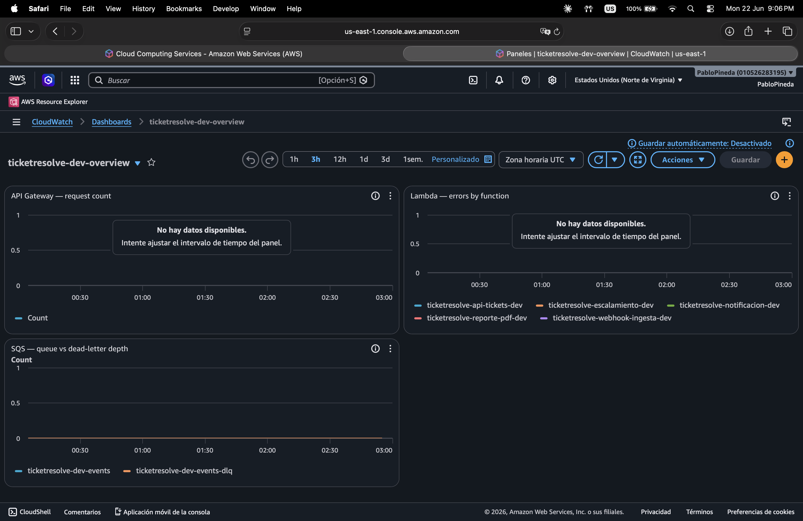
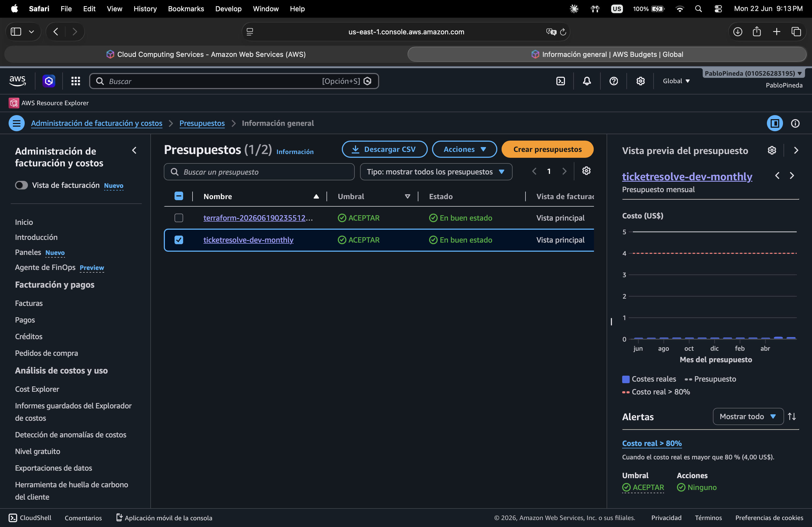

### Deliverable F — One-Click Deployment Proof

A `terraform destroy` on the main workspace followed by a single `git push` to
`main` brings the entire seven-component architecture up via the CD pipeline
(init → plan → apply), with no manual console actions. A second push with no
changes yields `terraform plan -detailed-exitcode` exit code 0.

Evidence: `evidence/clean-state-pipeline.png` (all jobs green) ·
[`evidence/terraform-output-full.txt`](evidence/terraform-output-full.txt) ·
[`evidence/idempotent-plan.txt`](evidence/idempotent-plan.txt).

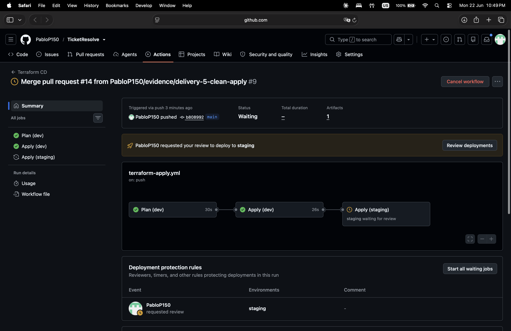

### Deliverable I — Full IaC Coverage Proof

[`docs/iac-coverage.md`](docs/iac-coverage.md) maps every component to its
Terraform resource across all seven categories and confirms no manual resources.

Evidence: [`evidence/state-list.txt`](evidence/state-list.txt) (`terraform state
list`) · `evidence/deployed-components.png` (running Lambdas in the console).

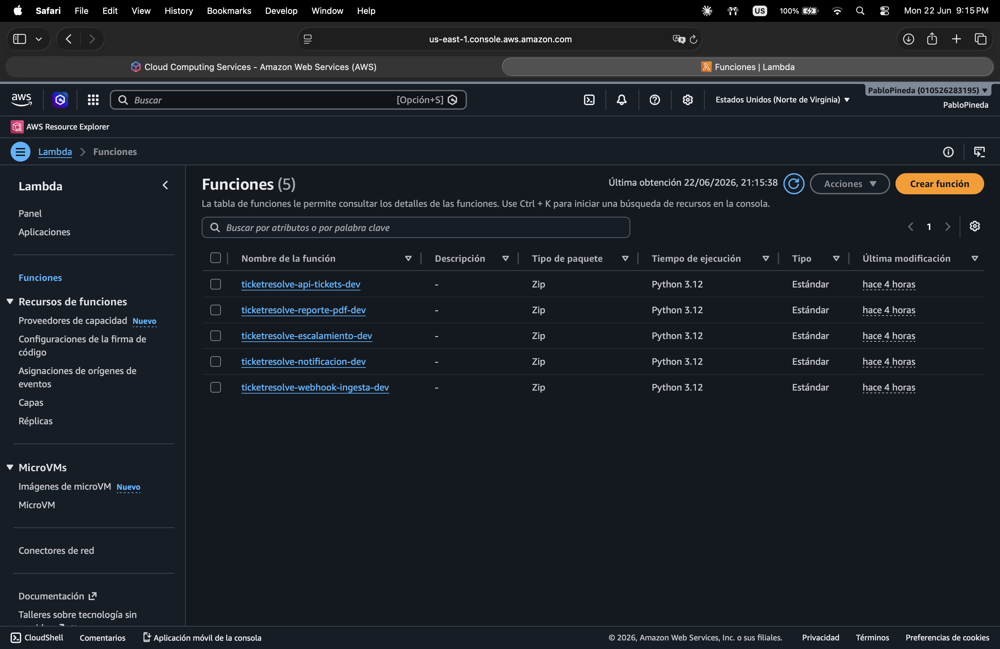

### Deliverable J — Slack Deployment Bot (optional)

A Slack `/deploy <environment>` bot (separate repository — see the summary for
the link) triggers the GitHub Actions pipeline via the `workflow_dispatch` API,
validates the environment, and replies with the environment, run URL and
timestamp.

Evidence: `evidence/bot-command.png` (slash command + bot confirmation) ·
`evidence/bot-pipeline-run.png` (the triggered run, started by the GitHub token).

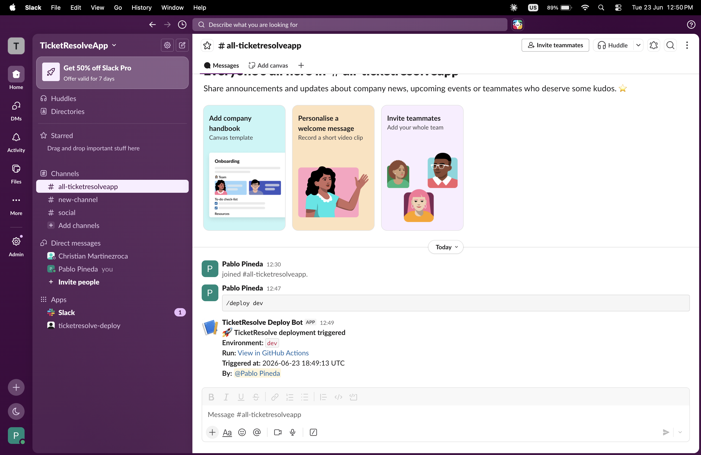
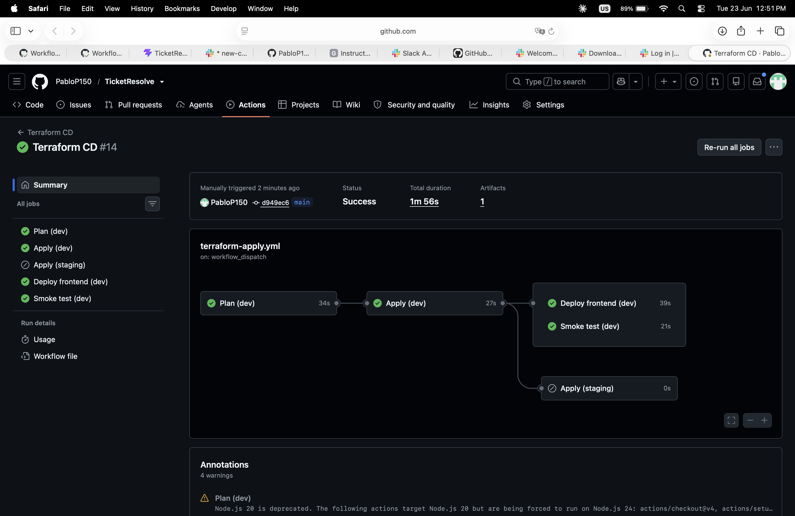

---

## Runbook — bring the whole system up from zero

This runbook brings the entire seven-component architecture up from a clean cloud
account with a single `git push`.

### 1. Required account permissions

- An AWS account; an operator able to run the **bootstrap** workspace once
  (create the S3 state bucket, the DynamoDB lock table and the delegated Route 53
  zone), and to create the GitHub Actions OIDC provider + CI runner role on the
  first main-workspace apply.
- After bootstrap, day-to-day deploys need **no long-lived AWS credentials** —
  GitHub Actions assumes the `ci-runner` role via OIDC.

### 2. One-time bootstrap (state backend + DNS delegation)

```bash
cd infra/bootstrap
terraform init
terraform apply        # creates the state bucket, lock table and the Route53 zone
terraform output dns_name_servers   # send these + the subdomain to the instructor
```

Send `dns_subdomain` (`grupo7.oyd.solid.com.gt`) and the four `dns_name_servers`
to the instructor so they delegate the subdomain from the parent
`oyd.solid.com.gt` zone. Wait until delegation is live (`dig NS
grupo7.oyd.solid.com.gt`) before the first main apply, or ACM DNS validation will
hang. The bootstrap workspace is **not** destroyed by the one-click proof, so the
name servers stay stable across destroy/re-apply cycles.

### 3. GitHub Environments and variables/secrets to configure

- **Environments:** `dev` (no reviewer) and `staging` (required reviewer). Set
  each environment's *Deployment branches* policy to **`main` only**.
- **Repository variable:** `AWS_CI_ROLE_ARN` = the `ci_runner_role_arn` Terraform
  output.
- **Repository secret:** `AWS_REGION` = `us-east-1`.
- **Removed (do not re-add):** `AWS_ACCESS_KEY_ID`, `AWS_SECRET_ACCESS_KEY`,
  `DEV_DB_PASSWORD`, `STAGING_DB_PASSWORD` — replaced by OIDC + Secrets Manager.

### 4. Trigger the pipeline with one push

```bash
git clone https://github.com/PabloP150/TicketResolve.git
cd TicketResolve
git checkout main
git commit --allow-empty -m "clean-state proof run"
git push origin main          # Terraform CD: init -> plan -> apply (dev), then gated staging
```

### 5. Verify every component is running

```bash
cd infra
terraform init -reconfigure -backend-config=envs/dev/backend-dev.hcl
terraform output                     # all seven components' outputs
terraform state list                 # one+ resource per category
terraform plan -detailed-exitcode \
  -var-file=envs/dev/dev.tfvars      # exit code 0 = idempotent

curl -v https://api.grupo7.oyd.solid.com.gt/   # 200 + TLS cert
curl -v http://app.grupo7.oyd.solid.com.gt/    # 301 -> https
```

> Backend note (Pattern A): the backend is partial — `terraform init` **must**
> receive `-backend-config=envs/<env>/backend-<env>.hcl`; a bare `terraform init`
> will not select the right state key.
